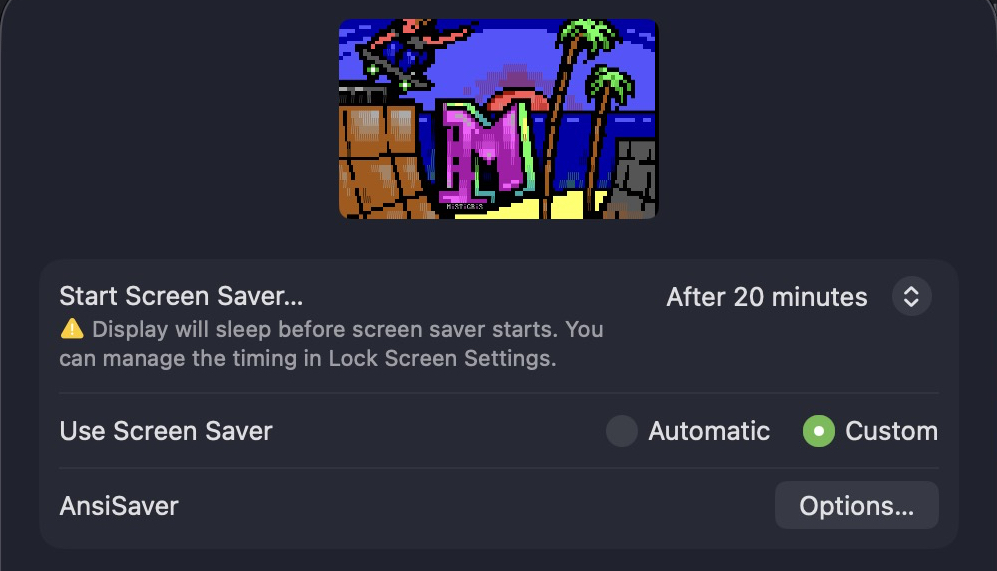
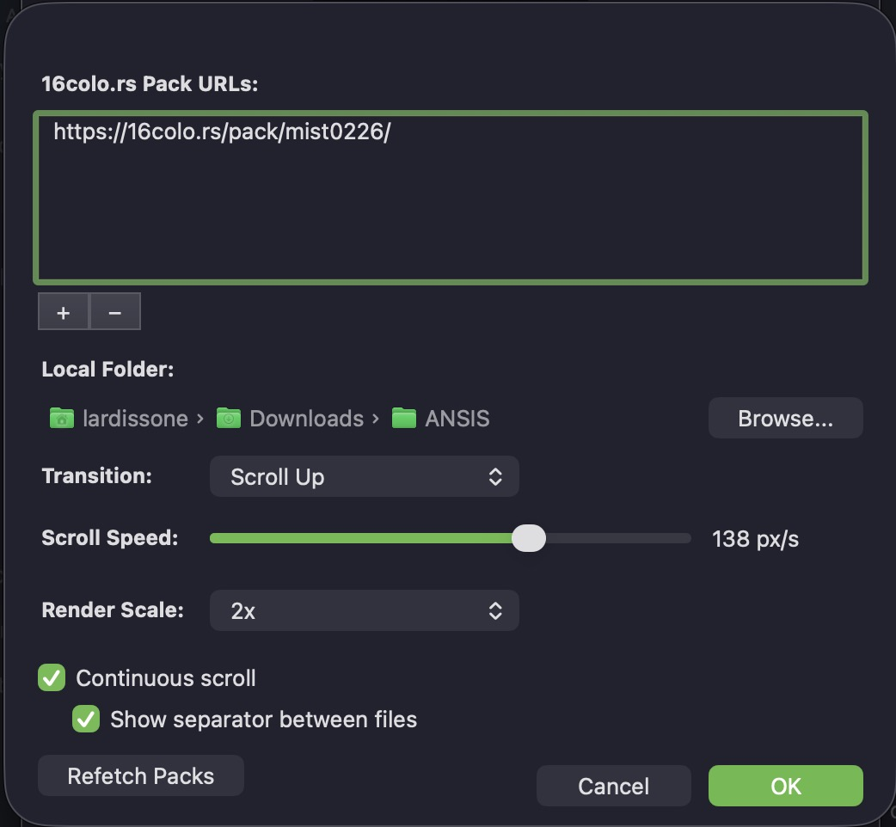

# AnsiSaver

A macOS screensaver that brings back the art of the BBS era.

```
┌──────────────────────────────────────────┐
│  ██▀▀▀▀▀▀▀▀▀▀▀▀▀▀▀▀▀▀▀▀▀▀▀▀▀▀▀▀▀▀▀██  │
│  ██  A N S I S A V E R             ▓██  │
│  ██  Your screen, circa 1994       ▒██  │
│  ██▄▄▄▄▄▄▄▄▄▄▄▄▄▄▄▄▄▄▄▄▄▄▄▄▄▄▄▄▄▄▄██  │
└──────────────────────────────────────────┘
```

Remember dialing into BBSes at 14.4k, watching ANSI art fill your terminal line by line? The vibrant CP437 characters, the neon color palettes, the logos crafted pixel-by-pixel by scene artists — that whole world lives on at [16colo.rs](https://16colo.rs), the largest ANSI/ASCII art archive on the internet.

AnsiSaver pulls art directly from 16colo.rs packs and scrolls it across your screen, rendered with the same [libansilove](https://www.ansilove.org/) library the archive uses. It's like leaving your terminal connected to a BBS you never logged off from.

<p align="center">
  
</p>

## What it does

- Downloads ANSI art packs from [16colo.rs](https://16colo.rs) and caches them locally
- Renders `.ANS`, `.ICE`, `.ASC`, `.BIN`, `.XB`, `.PCB`, and `.ADF` files with authentic CP437 fonts
- Scrolls art across your screen with smooth 60fps animation
- **Continuous scroll mode**: art files stack vertically into an endless stream, like a never-ending BBS file listing
- **Crossfade transitions**: smooth fade between pieces in standard mode
- Optional separator between files showing the filename — just like browsing a pack in ACiDView
- Configurable scroll speed and render scale (2x–4x for sharp output on Retina displays)
- Works with local folders too — point it at your personal ANSI art collection

## Installation

### Download

Grab the latest `AnsiSaver.saver.zip` from the [Releases](https://github.com/lardissone/ansi-saver/releases) page.

1. Unzip the file
2. Double-click `AnsiSaver.saver`
3. macOS will ask if you want to install it — click **Install**

> **macOS security notice:** Since the screensaver is not signed with an Apple Developer certificate, macOS will block it on first launch. Go to **System Settings > Privacy & Security**, scroll down, and click **Open Anyway** next to the AnsiSaver message. You only need to do this once.

### Build from source

If you prefer to build it yourself, you need [Homebrew](https://brew.sh/) and Xcode:

```bash
brew install libgd
git clone --recursive https://github.com/lardissone/ansi-saver.git
cd ansi-saver
xcodebuild -project AnsiSaver.xcodeproj -target AnsiSaver -configuration Release build
cp -R build/Release/AnsiSaver.saver ~/Library/Screen\ Savers/
```

> **Note:** Builds link statically against Homebrew's libgd (arm64). Requires Apple Silicon Mac with macOS Tahoe (26.0) or later.

## Configuration

Open **System Settings > Screen Saver**, select **AnsiSaver**, and click **Options...** to configure:

<p align="center">
  
</p>

### Art sources

**16colo.rs Pack URLs** — Add pack URLs to pull art from the archive. Browse packs at [16colo.rs](https://16colo.rs) and paste the URL:

```
https://16colo.rs/pack/acid-100/
https://16colo.rs/pack/mist0222/
https://16colo.rs/pack/blocktronics-space/
```

**Local Folder** — Point to a directory on disk containing `.ANS` files. Great for your personal collection or artpacks you've downloaded.

### Display options

| Option | Description |
|--------|-------------|
| **Transition** | Scroll Up, Scroll Down, or Crossfade between pieces |
| **Scroll Speed** | 10–200 px/s — how fast art scrolls across the screen |
| **Render Scale** | 1x–4x — higher values produce sharper output on Retina displays |
| **Continuous Scroll** | Stack all art into one endless vertical stream |
| **Show Separator** | Display a decorative divider with the filename between pieces (continuous mode) |

### Cache

Art files are cached in `~/Library/Caches/AnsiSaver/`. Hit **Refetch Packs** in the config panel to clear the cache and re-download everything.

## How it works

```
16colo.rs packs ──→ Download & cache ──→ libansilove ──→ Core Animation ──→ Screen
Local .ANS files ─────────────────────↗   (CP437 render)   (60fps scroll)
```

1. Art sources provide file paths (from network or disk)
2. [libansilove](https://github.com/ansilove/libansilove) renders each file to a PNG using authentic CP437 bitmap fonts — the same rendering 16colo.rs uses
3. Core Animation displays and scrolls the rendered images at 60fps
4. Files are rendered one at a time on demand, so even packs with thousands of files use minimal memory

## Recommended packs

A few packs to get you started:

| Pack | Era | Style |
|------|-----|-------|
| [ACiD 100](https://16colo.rs/pack/acid-100/) | 1995 | The legendary ACiD Productions centennial pack |
| [Mist 0222](https://16colo.rs/pack/mist0222/) | 2022 | Mistigris — still going strong after 28 years |
| [Blocktronics: Space](https://16colo.rs/pack/blocktronics-space/) | 2014 | Cosmic ANSI art from the modern scene |
| [iCE 9601](https://16colo.rs/pack/ice-9601/) | 1996 | iCE Advertisements — peak 90s ANSI |
| [Fire 01](https://16colo.rs/pack/fire-01/) | 1996 | Fire artpack from the golden era |

Browse the full archive at [16colo.rs](https://16colo.rs) — there are thousands of packs spanning from 1990 to the present day.

## Credits

- [libansilove](https://www.ansilove.org/) by the Ansilove team — the definitive ANSI art rendering library
- [16colo.rs](https://16colo.rs) — preserving the artscene since the early days
- The BBS artscene — ACiD, iCE, Fire, Mistigris, Blocktronics, and every group and artist who kept the art alive

## License

MIT
